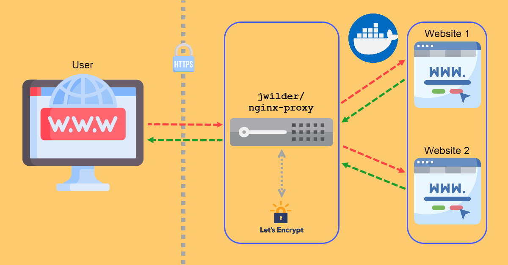

# Docker jwilder/nginx-proxy for multiple nginx containers

Configure environment

    bash init.sh

init.sh script will create necessary network: `reverseproxy_default`  and create env file: `docker/.env`

## Environment variables (./docker/.env)

    # Your email for LetsEncrypt
    DEFAULT_EMAIL=no-reply@example.com

    DHPARAM_GENERATION=false
    
    # Default Nginx main configuration
    NGINX_CONF_FILE=./nginx.d/nginx.conf
    
    COMPOSE_PROJECT_NAME=reverse_proxy
    
    # Use `production` for running LetsEncrypt on local environment you probably won't use SSL certificates
    # in that case just remove COMPOSE_PROFILES variable
    COMPOSE_PROFILES=production
    
    # On production environment use `always`
    RESTART="no"
    
    # If you place your docker.sock file in specific location you could specify it here
    DOCKER_SOCK_FILE=/var/run/docker.sock

---
    
# LetsEncrypt

Use compose profile: production

.env:

    ...
    COMPOSE_PROFILES=production
    ...
    

